# CodeGraphy — Mapa de Dependências

> Gerado em 2026-07-18, sob demanda (não é regra automática — ver decisão de
> escopo abaixo). Regenerar manualmente pedindo para "atualizar o
> CODEGRAPHY.md" quando a estrutura mudar bastante; não é atualizado a cada
> commit.

## Decisão de escopo

Uma versão *always-on* deste mapa (atualização obrigatória a cada
criação/renomeação/exclusão de arquivo, em toda resposta) foi avaliada e
recusada em 2026-07-18: o repo tem ~36 arquivos de código e ~5.300 linhas de
Python no backend — a mesma escala que já tinha motivado a recusa do skill
`/architecture` em 2026-07-12 por sobreposição com `/audit`. Esta versão leve
existe como referência pontual, gerada quando pedida.

## Árvore de diretórios (código-fonte)

```
.
├── index.html                          # site estático (raiz, deploy Vercel)
├── vendas.html                         # página de vendas estática
└── backend/                            # API FastAPI (roda fora da Vercel)
    ├── app.py                          # gateway REST — monta tudo
    ├── agent_construtor.py             # motor gerador de site-config (estável/congelado)
    ├── ai_provider.py                  # abstração do provedor de IA (Ollama/etc.)
    ├── schema_validator.py             # validação estrita do JSON de config
    ├── image_utils.py                  # normalização de logos (Pillow)
    ├── metrics.py                      # métricas do agente construtor
    ├── auth.py                         # verificação de API key
    ├── db.py                           # engine/sessão SQLAlchemy
    ├── models_db.py                    # modelos ORM (Site, Lead)
    ├── repository.py                   # acesso a dados (Site, Lead)
    ├── start_api.py                    # bootstrap do servidor
    ├── quickstart.py                   # setup helper
    ├── exemplo_uso.py                  # exemplo de uso do AgenteConstrutor
    ├── test_agentes.py                 # bateria de testes do motor (retry/confiabilidade)
    ├── test_api.py                     # testes de API via HTTP
    ├── test_ollama_provider.py         # smoke tests do OllamaProvider (validação de modelo)
    ├── agents/                         # agentes especializados (Fase 2)
    │   ├── __init__.py
    │   ├── hunter.py                   # AgenteHunter — qualifica leads
    │   ├── vendedor.py                 # AgenteVendedor — gera/envia demo
    │   └── financeiro.py               # Agente Financeiro (PIX)
    ├── routers/                        # routers FastAPI montados em app.py
    │   ├── __init__.py
    │   ├── whatsapp_inbound.py         # webhook WhatsApp
    │   ├── demo_dfy.py                 # geração de demo DFY
    │   ├── demo_preview.py             # preview de demo
    │   └── demo.py                     # rotas de demo
    ├── scripts/                        # scripts standalone (CLI, não importados por app.py)
    │   ├── buscar_leads_google_maps.py
    │   ├── checklist_followup.py
    │   ├── exportar_leads_excel.py
    │   ├── gerar_demo_dfy.py
    │   ├── gerar_portfolio_lovable.py
    │   ├── simular_esteira.py
    │   └── validar_leads_google_maps.py
    └── alembic/                        # migrações de schema
        ├── env.py
        └── versions/
            ├── 0001_create_sites_table.py
            └── 0002_create_leads_table.py
```

## Dependências por módulo (import interno → quem importa)

| Módulo | Importa (interno) | Importado por |
|---|---|---|
| `app.py` | `agent_construtor`, `schema_validator`, `metrics`, `image_utils`, `db`, `repository`, `auth`, `routers.whatsapp_inbound`, `routers.demo_dfy`, `routers.demo_preview`, `routers.demo` | — (entrypoint) |
| `agent_construtor.py` | `schema_validator`, `metrics`, `ai_provider`, `image_utils` | `app.py`, `exemplo_uso.py`, `test_agentes.py`, `routers/demo_dfy.py`, `scripts/gerar_demo_dfy.py`, `scripts/gerar_portfolio_lovable.py`, `scripts/simular_esteira.py` |
| `schema_validator.py` | — | `app.py`, `agent_construtor.py`, `test_agentes.py` |
| `ai_provider.py` | — | `agent_construtor.py` |
| `image_utils.py` | — | `app.py`, `agent_construtor.py`, `agents/vendedor.py`, `routers/demo_dfy.py`, `scripts/gerar_demo_dfy.py` |
| `metrics.py` | — | `app.py`, `agent_construtor.py` |
| `auth.py` | — | `app.py`, `routers/demo_dfy.py` |
| `db.py` | — (define `Base`, `get_db`) | `app.py`, `models_db.py`, `routers/whatsapp_inbound.py`, `alembic/env.py` |
| `models_db.py` | `db` | `repository.py`, `alembic/env.py` |
| `repository.py` | `models_db` | `app.py`, `routers/whatsapp_inbound.py` |
| `routers/whatsapp_inbound.py` | `repository`, `db` | `app.py` |
| `routers/demo_dfy.py` | `agent_construtor`, `image_utils`, `auth` | `app.py` |
| `routers/demo_preview.py` | — | `app.py` |
| `routers/demo.py` | — | `app.py` |
| `agents/hunter.py` | — | `scripts/simular_esteira.py` |
| `agents/vendedor.py` | `image_utils` | `scripts/gerar_portfolio_lovable.py`, `scripts/simular_esteira.py` |
| `agents/financeiro.py` | — | (ainda não consumido por nenhum outro módulo) |
| `scripts/buscar_leads_google_maps.py` | — (expõe `CIDADES`) | `scripts/checklist_followup.py`, `scripts/exportar_leads_excel.py` |
| `exemplo_uso.py` | `agent_construtor` | — |
| `test_agentes.py` | `agent_construtor`, `schema_validator` | — |
| `test_ollama_provider.py` | `ai_provider` | — |
| `alembic/env.py` | `db`, `models_db` | — (entrypoint do Alembic) |

## Diagrama

```mermaid
graph TD
    app[app.py]
    agent_construtor[agent_construtor.py]
    schema_validator[schema_validator.py]
    ai_provider[ai_provider.py]
    image_utils[image_utils.py]
    metrics[metrics.py]
    auth[auth.py]
    db[db.py]
    models_db[models_db.py]
    repository[repository.py]
    r_whatsapp[routers/whatsapp_inbound.py]
    r_demo_dfy[routers/demo_dfy.py]
    r_demo_preview[routers/demo_preview.py]
    r_demo[routers/demo.py]
    hunter[agents/hunter.py]
    vendedor[agents/vendedor.py]
    financeiro[agents/financeiro.py]
    buscar_leads[scripts/buscar_leads_google_maps.py]
    checklist[scripts/checklist_followup.py]
    exportar_excel[scripts/exportar_leads_excel.py]
    gerar_demo_dfy[scripts/gerar_demo_dfy.py]
    gerar_portfolio[scripts/gerar_portfolio_lovable.py]
    simular_esteira[scripts/simular_esteira.py]
    exemplo_uso[exemplo_uso.py]
    test_agentes[test_agentes.py]
    test_ollama[test_ollama_provider.py]
    alembic_env[alembic/env.py]

    app --> agent_construtor
    app --> schema_validator
    app --> metrics
    app --> image_utils
    app --> db
    app --> repository
    app --> auth
    app --> r_whatsapp
    app --> r_demo_dfy
    app --> r_demo_preview
    app --> r_demo

    agent_construtor --> schema_validator
    agent_construtor --> metrics
    agent_construtor --> ai_provider
    agent_construtor --> image_utils

    models_db --> db
    repository --> models_db
    r_whatsapp --> repository
    r_whatsapp --> db
    r_demo_dfy --> agent_construtor
    r_demo_dfy --> image_utils
    r_demo_dfy --> auth

    vendedor --> image_utils

    checklist --> buscar_leads
    exportar_excel --> buscar_leads

    gerar_demo_dfy --> agent_construtor
    gerar_demo_dfy --> image_utils
    gerar_portfolio --> agent_construtor
    gerar_portfolio --> vendedor
    simular_esteira --> hunter
    simular_esteira --> vendedor
    simular_esteira --> agent_construtor

    exemplo_uso --> agent_construtor
    test_agentes --> agent_construtor
    test_agentes --> schema_validator

    alembic_env --> db
    alembic_env --> models_db
```



## Arquivos centrais (mais importados)

1. **`agent_construtor.py`** — 6 importadores (motor congelado; ver `CLAUDE.md`).
2. **`image_utils.py`** — 5 importadores.
3. **`schema_validator.py`**, **`db.py`** — 3 importadores cada.
4. **`repository.py`**, **`metrics.py`**, **`auth.py`**, **`models_db.py`** — 2 importadores cada.

## Folhas / órfãos

- **`agents/financeiro.py`** — implementado mas ainda não importado por nenhum outro módulo (Agente Financeiro/PIX ainda não integrado ao pipeline; ver roadmap de agentes especializados).
- **`quickstart.py`**, **`start_api.py`**, **`test_api.py`** — scripts standalone, sem importadores internos (entrypoints/CLI).
- **`scripts/validar_leads_google_maps.py`** — standalone, sem importadores internos.
- `index.html`, `vendas.html` — não são Python; consumidos apenas via `site-config.json` e deploy estático, fora do grafo de imports.

## Ciclos de dependência

Nenhum encontrado. O grafo é acíclico — `app.py` e os `scripts/*` são os únicos
pontos de entrada, e `agent_construtor.py` é o hub central sem depender de
nada que dependa dele de volta.

## Notas específicas de Python/FastAPI

- Imports em `app.py` são feitos dentro de um bloco (não no topo do módulo) —
  ver `app.py:30-40` — antes de montar os routers via `app.include_router(...)`.
- `Depends(...)` usado para injeção de dependência: `verificar_api_key` (de
  `auth.py`) protege rotas administrativas; `get_db` (de `db.py`) injeta a
  sessão SQLAlchemy nas rotas que acessam banco.
- `models_db.py` registra `Site`/`Lead` em `Base.metadata` só por ser
  importado (mesmo sem uso direto) em `alembic/env.py:23` — necessário para o
  autogenerate do Alembic enxergar as tabelas.

---

## Changelog (hardening de segurança operacional)

### 2026-07-26 — OllamaProvider: remoção de auto-pull

**Arquivo:** `backend/ai_provider.py` (classe `ProvedorOllama`)

**Problema:** O servidor Ollama baixa automaticamente modelos ausentes ao receber
requisições em `/api/generate`. Se o modelo configurado não existisse localmente,
o `ProvedorOllama` iniciava silenciosamente um download de vários GB sem aviso.

**Solução:** Validação explícita no `__init__` via `/api/tags` — verifica se o
modelo existe antes de qualquer chamada. Se ausente, levanta `ErroProvedorIA`
com:
- nome do modelo solicitado
- lista de modelos disponíveis localmente
- comando manual para instalar (`ollama pull <modelo>`)

**O que mudou:**
- `ProvedorOllama.__init__` agora aceita `_requests_module` para testabilidade
- Novo método `_validar_modelo_local()` — checagem explícita antes de gerar
- Nenhuma chamada a `/api/generate` é feita se o modelo não existe

**O que NÃO mudou:**
- Ordem de fallback (gemini → nvidia_nim → anthropic → ollama)
- Configuração via env vars (`OLLAMA_MODEL`, `OLLAMA_URL`)
- Compatibilidade com `llama3:latest` (modelo padrão)

**Testes:** `backend/test_ollama_provider.py` — 8 cenários:
1. Modelo existe → init OK
2. Modelo com tag (:8b) existe → init OK
3. Modelo inexistente → `ErroProvedorIA` com instrução de pull
4. Erro lista modelos disponíveis
5. Modelo inexistente → `/api/generate` nunca chamado
6. Modelo existe → `gerar_json` funciona
7. Modelo custom com `:latest` existe → init OK
8. Modelo sem tag mas tag disponível → erro com sugestão de versão
