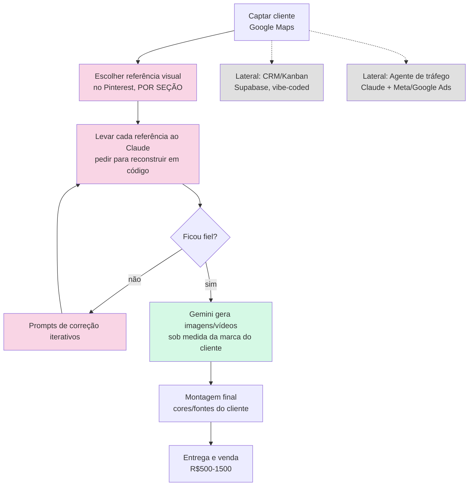

# Análise: Workflow "Pinterest → Claude → Gemini" (referência: vídeo de terceiro)

**Status: documento apenas. Nenhum código foi alterado a partir desta análise.**

## 1. Objetivo desta análise

Um vídeo de terceiros (canal "a vizinhança", depoimento de venda de site
institucional por R$4.000) descreve um processo de construção de site
usando Pinterest como referência visual, Claude (Anthropic — o autor do
vídeo fala "cloud", fonética de "Claude") para reconstruir cada seção em
código, e Gemini para gerar imagens/vídeos sob medida.

Este documento **não propõe copiar esse processo**. Responde 5 perguntas:

1. Quais etapas são 100% humanas?
2. Quais podem ser assistidas por IA?
3. Quais podem ser automatizadas?
4. Quais fazem sentido para o modelo DFY atual (`docs/playbook_dfy_v1.md`)?
5. Quais podem, no futuro, entrar no `agent_construtor.py` sem quebrar a
   arquitetura existente?

Nenhuma implementação, nenhuma mudança de código, nenhuma proposta de
alterar `agent_construtor.py` agora — isso é evolução incremental
baseada em evidência, não decisão tomada aqui.

**Convenção deste documento:** as seções 2-3 descrevem só o que o vídeo
mostra (observação, sem juízo de valor). As seções 4-8 são análise e
conclusão do projeto, sempre citando o documento-fonte real
(`CLAUDE.md`, `ROADMAP.md`, DoPS, ou outro arquivo em `docs/`). Onde a
única fonte disponível é uma memória de sessão (não um documento formal
do projeto), isso é dito explicitamente — para não confundir "já
decidido" com "observado numa sessão anterior".

## 2. Fluxograma do processo descrito no vídeo

Rosa = decisão/execução humana com IA como ferramenta. Verde = geração
automatizável. Cinza = fora do escopo direto desta análise (produtos
paralelos aparecidos no mesmo vídeo).

## 3. Decomposição em etapas

| # | Etapa | Entrada | Saída | Ferramenta | Decisão humana? |
|---|---|---|---|---|---|
| 1 | Captar cliente | Nicho/cidade | Lead (empresa, contato) | Google Maps | Não — já automatizado (`backend/agents/hunter` do roadmap) |
| 2 | Escolher referência por seção | Nicho, "gosto" do que funciona | 1 imagem/site de referência por seção (hero, depoimentos, etc.) | Pinterest (navegação manual) | **Sim, integralmente** — é curadoria estética, "misturar" referências de propósito (o autor chama de "Frankenstein") |
| 3 | Reconstruir seção em código | Referência visual + prompt | HTML/CSS daquela seção | Claude (conversacional) | Sim — várias rodadas de "prompt de correção" até aceitar o resultado |
| 4 | Gerar imagem/vídeo sob medida | Logo, tema do negócio | Imagem/vídeo customizado | Gemini | Parcial — humano escreve o prompt/tema, mas a geração em si é automática |
| 5 | Montagem final na identidade do cliente | Seções + imagens + paleta | Site publicável | Manual (colar tudo) | Sim |
| 6 (lateral) | CRM/Kanban de leads | — | Ferramenta separada (Supabase) | Vibe coding | Produto à parte, não é o site |
| 7 (lateral) | Agente gestor de tráfego | Contas Meta/Google Ads | Relatórios/otimização de campanha | Claude + MCP de Ads | Produto à parte |

## 4. Classificação por etapa

| Etapa | Classificação | Por quê |
|---|---|---|
| 1. Captar cliente | **Já automatizada** | Hunter (roadmap) já cobre isso hoje via Google Maps |
| 2. Referência Pinterest por seção | **Manual** | Julgamento estético não é replicável de forma confiável hoje; Pinterest não oferece API pública de busca em escala (scraping viola os termos deles); usar a referência de outro site como "molde" pra clonar traz risco de direitos autorais mesmo quando "só inspira" — risco cresce se virar processo comercial repetido, não um freela pontual |
| 3. Clonar seção via IA conversacional | **Assistida (hoje), não automatizável sem mudar a arquitetura** | Produz **código único por cliente** — o oposto da premissa central do projeto ("toda customização de cliente reside no JSON, nunca hardcoded no HTML", `CLAUDE.md`). Automatizar isso significaria abandonar o template único, não evoluí-lo |
| 4. Geração de imagem/vídeo sob medida (Gemini) | **Automatizável, com ressalvas** | Já existe spec pronta pra isso: `docs/pipeline_imagens_inteligente.md` (cascata banco próprio → bancos gratuitos → geração por IA como último recurso, com guardrails de licenciamento e anti-depoimento-falso). **Vídeo especificamente: não recomendado no curto prazo** — geração de vídeo por IA leva minutos, quebra a promessa de "menos de 30 segundos" (`CLAUDE.md`), e o schema atual (`site-config.json`) não tem campo de vídeo |
| 5. Montagem final na identidade do cliente | **Já automatizada** | É exatamente o que `agent_construtor.py` + template + paleta de cores já fazem hoje, de forma padronizada e determinística |
| 6. CRM/Kanban | **Fora do escopo desta análise** | Não existe hoje no `ROADMAP.md` — a Fase 3 lista Hunter/Vendedor/Financeiro(PIX), e o "Financeiro" ali é conciliação de pagamento, não CRM de leads. É achado lateral, ideia nova, não uma lacuna num plano já existente |
| 7. Agente de tráfego | **Fora do escopo desta análise** | Upsell futuro possível, não é o objeto do vídeo nem desta análise |

## 5. Comparação com a arquitetura atual

| Dimensão | Vídeo (Pinterest→Claude→Gemini) | Fábrica de Sites hoje |
|---|---|---|
| Modelo de produção | Bespoke — 1 site único por cliente, construído à mão | Templado — 1 estrutura HTML/Tailwind, customização 100% via JSON |
| Tempo por site | Não informado, mas envolve várias rodadas de correção manual (horas) | < 30 segundos (`CLAUDE.md`) |
| Preço | R$500-1500 (interior, cliente sem referência de mercado) | Hipótese de teste: R$149/mês recorrente (`docs/playbook_dfy_v1.md`) |
| Fonte de imagem | Pinterest (referência) + Gemini (geração) | Unsplash (banco curado, determinístico) — nunca geração por IA até hoje (`docs/pipeline_imagens_inteligente.md`, seção 2) |
| Escala | 1 pessoa, 1 site de cada vez | Pipeline pensado pra gerar N sites em paralelo |
| Ponto forte | Resultado visual muito customizado, "uau" imediato pro cliente do interior | Consistência, custo zero por imagem, velocidade, sem intervenção humana |

**A tensão central não é técnica, é de modelo de negócio**: o vídeo é
essencialmente "freelancer de web design usando IA como ferramenta", não
uma SaaS. Isso não é uma crítica — é um modelo de produção genuinamente
diferente, que hoje já tem um lugar equivalente no projeto: o funil
DFY (`docs/playbook_dfy_v1.md`, seção 4 — "Revisão humana" entre a
geração e a apresentação), que já prevê entrega manual/assistida com
revisão humana antes de qualquer automação em lote.

## 6. Impacto em DoPS, Image Engine e Roadmap

**DoPS (`docs/definition-of-professional-site.md`):** nenhum critério
muda. A geração de imagem sob medida (etapa 4) pode ajudar a atingir os
critérios de imagem existentes (IMG-01 a IMG-07) com mais precisão pro
nicho, mas não introduz critério novo — se algum dia a geração por IA for
habilitada, ela é avaliada pelos MESMOS critérios que uma foto do
Unsplash, não por um padrão à parte.

**Image Engine (`backend/image_utils.py`):** o estado atual, descrito em
`docs/pipeline_imagens_inteligente.md` (seção 2), é busca de foto real
por categoria fixa (Unsplash), nunca geração por IA. O mesmo documento
(seção 3) **já propõe** uma cascata futura que inclui geração por IA
como último recurso — este documento não substitui aquele, só confirma
que ele já cobre a parte "Gemini gera imagem" desta análise. O gate de
priorização já registrado lá e também no `ROADMAP.md` (backlog: só
depois de 15-20 vendas DFY **e** quando o banco fixo se mostrar
insuficiente na prática) continua válido e se aplica aqui também.

**Roadmap:** nenhuma fase nova proposta. A etapa 3 (clonar seção via IA
conversacional, gerando HTML/CSS único por cliente) conflita com o
Princípio Arquitetural #1 do `ROADMAP.md` ("JSON Schema Driven — toda
customização de cliente vive no JSON, nunca hardcoded") — esse princípio
está formalmente documentado, ao contrário de uma referência anterior
deste documento a um "Design Engine/Visual Profile fora de escopo" que
existia só em memória de sessão (9 dias, nunca formalizada em
`CLAUDE.md`/`ROADMAP.md`) e foi removida desta versão por precisão. A
conclusão prática não muda: não recomendo reabrir essa discussão sem
dados de venda novos.

## 7. Tabela final de decisão

| Etapa | Vale incorporar? | Quando? | Complexidade | ROI |
|---|---|---|---|---|
| 1. Captar cliente | Já incorporado | Já | — | — |
| 2. Referência Pinterest por seção | **Não**, nesse formato (scraping/clonagem) | Nunca, a menos que vire produto bespoke separado com preço que cubra o risco | Alta (ToS, direitos autorais) | Baixo pro modelo SaaS atual |
| 3. Clonar seção via Claude conversacional | **Não agora** | Só se houver decisão explícita de abrir uma linha de produto bespoke separada (preço R$500-1500), não como evolução do pipeline automatizado | Alta — muda a arquitetura de "template único" | Alto *se* o negócio pivotar pra bespoke; conflita com o modelo atual se não pivotar |
| 4. Geração de imagem sob medida (Gemini) | **Vale avaliar** | Depois do gate já definido em `docs/pipeline_imagens_inteligente.md` (15-20 vendas DFY + banco fixo insuficiente na prática) | Média (spec já existe) | Médio-alto — qualidade visual é um fator já apontado (em sessão anterior, não em documento formal) como causa de venda perdida; vale validar formalmente antes de priorizar |
| 5. Geração de vídeo sob medida (Gemini) | **Não no curto prazo** | Não antes de o schema ter campo de vídeo e a promessa de velocidade ser revisada deliberadamente | Alta (custo, latência, sem campo no schema) | Baixo no modelo atual |
| 6. Montagem final | Já incorporado | Já | — | — |
| 7. CRM/Kanban (lateral) | Vale considerar | Ideia nova, sem lugar hoje no `ROADMAP.md` — avaliar se entra no roadmap de agentes especializados quando houver espaço | Média | Alto como upsell, não avaliado a fundo aqui |
| 8. Agente de tráfego (lateral) | Vale considerar como ideia futura | Fase posterior, não prioritária agora | Alta | Médio, não avaliado a fundo aqui |

## 8. Recomendação objetiva

**Não implementar nada agora.** As duas peças com ROI real (geração de
imagem sob medida via Gemini) já têm spec pronta e gate de priorização
definido (`docs/pipeline_imagens_inteligente.md`) — o vídeo não muda essa
decisão, só reforça que ela está na direção certa. As peças com maior
"uau" visual no vídeo (Pinterest como referência, Claude clonando seção
por seção) dependem de uma decisão de modelo de negócio (bespoke vs.
templado) que não é técnica e não deve ser tomada como efeito colateral
de uma análise de workflow.
