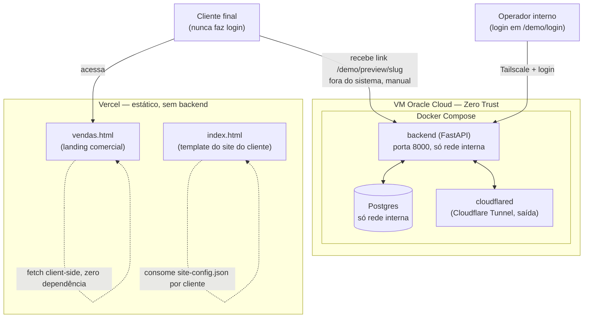
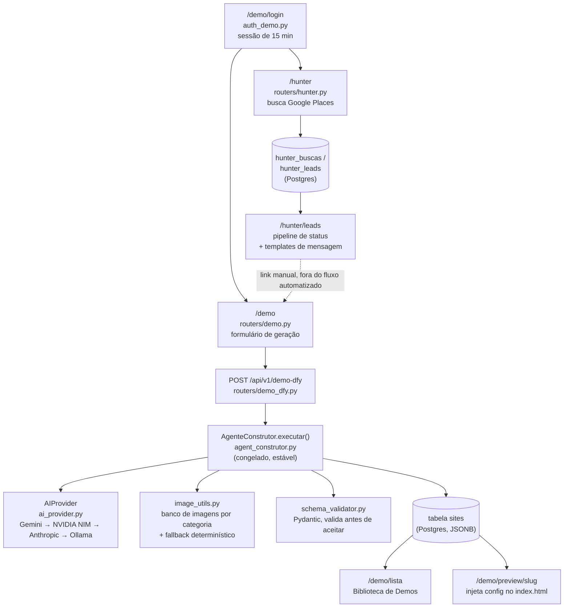
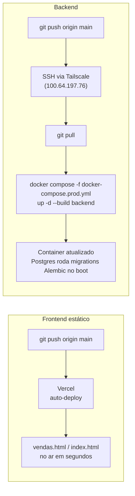
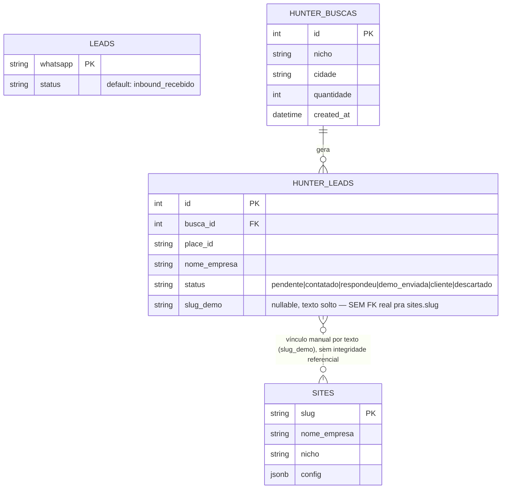

# 02 — Arquitetura

> Fonte: leitura direta de `backend/app.py`, `backend/routers/*.py`, `Dockerfile`, `docker-compose.prod.yml`, `infra/zero_trust_deploy.md`, `index.html`, `vendas.html`. Diagramas descrevem o que o código faz hoje, não o que a documentação antiga (`CLAUDE.md`) descreve — ver seção "Divergência" ao final.

## Visão geral: dois sistemas independentes

O projeto não é um site só — são **dois sites estáticos** (Vercel) e **um backend** (VM própria), com fronteiras deliberadas entre eles:

- **`vendas.html`** — a landing comercial (vende o produto). Zero dependência do backend: busca `vendas-config.json` direto do CDN da Vercel via `fetch()`. Continua no ar mesmo se o backend cair.
- **`index.html`** — o template que vira o site de cada cliente pago. Também estático, também na Vercel, injeta os dados de `site-config.json` (por cliente).
- **Backend FastAPI** (`backend/app.py`) — roda numa VM Oracle Cloud, nunca na Vercel. É onde vivem: o motor de geração de site, o Postgres, o Hunter, o login da ferramenta interna.

## Fluxo interno do backend (ferramenta que o operador usa)

## Deploy: dois pipelines independentes

Nenhum dos dois pipelines depende do outro. Um push que só mexe em `vendas.html` não precisa (e não deve) disparar rebuild do backend — e vice-versa.

## Modelo de dados (Postgres, `backend/models_db.py`)

`LEADS` (webhook do WhatsApp) e `HUNTER_LEADS` (prospecção do Hunter) são tabelas **separadas e não relacionadas** hoje — um contato que chega pelo WhatsApp oficial não se cruza automaticamente com um lead que o Hunter encontrou.

## Zero Trust — por que não há porta aberta

`docker-compose.prod.yml` não publica nenhuma porta de `db`/`backend` pro host (sem `ports:` nesses serviços — só existem na rede Docker interna `internal_net`). O único jeito de entrar é:
- **Tailscale** (mesh privada) — pra administração da máquina (SSH).
- **Cloudflare Tunnel** (`cloudflared`, saída apenas) — pra tráfego HTTP chegar no backend de fora, sem nunca abrir porta de entrada na VM.

Isso está documentado em `infra/zero_trust_deploy.md` e é a razão pela qual, por exemplo, tentar conectar direto num Postgres de produção a partir de uma máquina de desenvolvimento comum simplesmente não funciona — não é bug, é a arquitetura funcionando como projetada.

## Divergência entre documentação antiga e arquitetura real

`CLAUDE.md` (raiz) e `ROADMAP.md` ainda descrevem o backend como pendente de deploy em **Render/Railway**. Isso foi substituído pela arquitetura Zero Trust em Oracle Cloud (commits a partir de `8b1e736`, documentado em `infra/zero_trust_deploy.md`), mas os dois documentos-fonte nunca foram atualizados para refletir essa mudança. Qualquer leitura futura desses dois arquivos (por uma pessoa ou por uma IA) deve desconfiar dessa seção específica até que seja corrigida.
