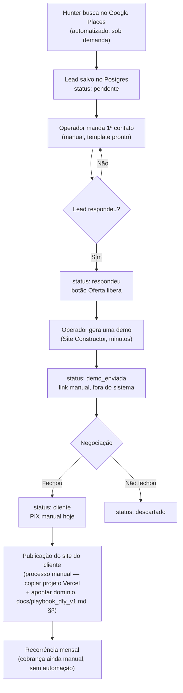

# 04 — Fluxo do Negócio e Modelo Comercial

## Fluxo real, como a empresa funciona hoje

> Fonte: código (`backend/routers/hunter.py`, `demo.py`, `demo_dfy.py`, `demo_preview.py`) + processo manual documentado em `docs/playbook_dfy_v1.md`. Onde uma etapa é manual/fora do sistema, está marcado.

**Onde estão os gargalos, hoje (interpretação com base no que o código automatiza vs. não automatiza):**

| Etapa | Automatizado? | Gargalo real |
|---|---|---|
| Encontrar leads | ✅ Sim (Hunter) | Nenhum — o sistema já encontra mais leads do que a operação consegue trabalhar |
| Abordar (1º contato) | 🟡 Template pronto, envio manual | Depende de tempo humano disponível |
| Gerar demo | ✅ Sim (minutos) | Nenhum |
| Fechar venda | 🔴 100% manual/humano | **Este é o gargalo real** — não há dado no repositório mostrando quantas vendas foram fechadas até hoje |
| Publicar site do cliente | 🔴 Processo manual (copiar projeto Vercel, apontar domínio) | Escala mal se o volume de clientes crescer rápido — hoje é aceitável no volume atual |
| Cobrar recorrência | 🔴 Não existe (nem manual documentado como rotina) | Risco de churn silencioso por falta de cobrança consistente |

**Riscos do fluxo atual:**
- Publicação manual de site por cliente não escala além de dezenas de clientes sem virar gargalo operacional.
- Sem cobrança recorrente automatizada, a receita mensal depende de alguém lembrar de cobrar — risco real de vazamento de faturamento.
- Sem uma tabela relacionando `hunter_leads` a `sites` por chave estrangeira real (só um campo de texto solto, `slug_demo`), rastrear "qual lead virou qual cliente" depende de disciplina manual, não de garantia do banco.

**Oportunidades visíveis no código, ainda não usadas:**
- O agente `AgenteFinanceiro` (`backend/agents/financeiro.py`) já tem lógica de conciliação PIX pronta — falta só plugar um webhook de gateway real (Asaas é a recomendação já registrada em `docs/fluxo_financeiro_recorrencia.md`).
- O agente `AgenteVendedor` já tem lógica de mensagem/scoring pronta — quando o gate de 15-20 vendas manuais for atingido, a automação de follow-up pode ser ligada sem reescrever nada, só trocando o mock por uma chamada real.

## Modelo Comercial

> Esta seção é síntese estratégica — a origem do dado é `vendas-config.json` (posicionamento e preço reais publicados) combinada com decisões de negócio já registradas no histórico do projeto. Está marcada como interpretação, não como fato de código.

**O que vendemos:** um site profissional, gerado por IA, para pequenos negócios locais que ainda não têm presença digital — não é "mais um construtor de sites", é a combinação de descobrir quem precisa (Hunter) + entregar rápido (Agente Construtor).

**Quem compra (hoje):** negócios locais nos nichos e regiões já validados — clínicas na Grande Vitória-ES e prestadores de serviço em Paraty-RJ (`vendas-config.json.faq`, resposta sobre atendimento fora de clínicas/consultórios).

**Cliente ideal:** um pequeno negócio que já tem clientes por indicação/Instagram, mas nenhuma presença que apareça no Google — ou seja, alguém que perde cliente novo especificamente por não ser encontrado, não por falta de qualidade no serviço que presta.

**Proposta de valor:** site no ar rápido, preço de entrada baixo (R$149/mês), sem contrato de fidelidade, com WhatsApp como canal central de conversão (todo botão de ação no site leva pro WhatsApp, `vendas-config.json.differentials`).

**Por que somos diferentes de:**

| Alternativa | Diferença real (com base no que está implementado) |
|---|---|
| Freelancer | Processo repetível via `agent_construtor.py` — qualidade não depende de disponibilidade de uma pessoa específica |
| Agência tradicional | Site em minutos, não semanas — o motor de geração é o diferencial de velocidade |
| Wix/WordPress | O cliente não edita nada — recebe pronto, sem precisar aprender ferramenta nenhuma |
| Hostinger/construtores genéricos | Prospecção embutida (Hunter) — não é só "construa seu site", é "nós achamos quem precisa e já entregamos pronto" |
| IA genérica (ChatGPT + template) | Todo o pipeline (schema validado, fallback de imagem garantido, anti-fabricação de depoimento) é construído especificamente pra nunca entregar um site quebrado ou com dado inventado — ver regras 10 em [03-regras-de-negocio.md](03-regras-de-negocio.md) |

**Ressalva honesta:** nenhuma dessas comparações tem prova de mercado (pesquisa de concorrente, dado de conversão comparado) no repositório — é a lógica de produto, não um dado medido.
