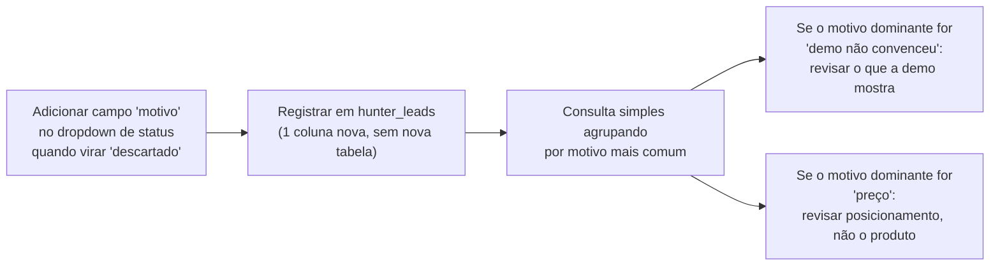

# 08 — Dados, Melhoria Orientada por Dados e Experimentos

## O que o sistema coleta hoje

> Fonte: `backend/models_db.py` (schema real das 4 tabelas).

- **`sites`**: todo site gerado (slug, nome da empresa, nicho, config completo em JSON).
- **`leads`**: contato que chegou pelo webhook oficial do WhatsApp (`whatsapp`, `status`) — hoje só grava, nada mais.
- **`hunter_buscas`**: toda execução de busca do Hunter, mesmo sem resultado (nicho, cidade, quantidade pedida, data).
- **`hunter_leads`**: cada empresa encontrada, com status atual do pipeline comercial e link solto (texto) pra um site gerado, se houver.

## O que ainda NÃO coleta

- **Histórico de transição de status** — `hunter_leads.status` só guarda o estado atual; quando um lead passa de "pendente" pra "contatado", a informação de "quando" e "quanto tempo ficou em cada estado" se perde.
- **Motivo de descarte** — quando um lead vira `status = 'descartado'`, não há campo pra registrar por quê (preço, não respondeu mais, já tinha site, etc.).
- **Qualquer dado financeiro** — não existe tabela de assinatura, pagamento ou cobrança.
- **Qualquer dado de satisfação do cliente final** — nenhum mecanismo de coleta de feedback.
- **Tempo de geração de demo** — o motor de geração não registra quanto tempo levou nem quantas tentativas de retry foram necessárias, de forma persistida e consultável.
- **Motivo de abandono após receber a demo** — se um cliente vê a demo e não segue adiante, o sistema não pergunta por quê nem registra.

## Classificação (Crítico / Importante / Futuro)

| Dado a coletar | Classificação | Por quê |
|---|---|---|
| Motivo de descarte de lead | **Crítico** | É a informação mais barata de coletar (um campo a mais no formulário de mudança de status) e a mais valiosa pra melhorar a abordagem |
| Histórico de transição de status | **Crítico** | Sem isso, nenhum KPI de tempo de conversão é possível |
| Vendas fechadas (número real) | **Crítico** | Não existe hoje em lugar nenhum — é a métrica mais básica do negócio |
| Motivo de abandono pós-demo | Importante | Ajuda a melhorar a geração/apresentação da demo |
| Dado financeiro (assinatura/pagamento) | Importante | Necessário antes de qualquer automação de cobrança |
| Tempo de geração / taxa de retry | Futuro | Só importa quando o volume de geração for alto o suficiente pra virar gargalo perceptível |
| Satisfação do cliente final | Futuro | Só faz sentido depois de haver uma base de clientes ativa o bastante pra pesquisar |

## Como transformar dado em melhoria (exemplo do próprio pedido do sócio)

> "Muitos clientes abandonam após receber a demo" — fluxo de como isso viraria melhoria real, sem introduzir IA onde não precisa:

Nenhuma etapa desse fluxo pede IA nova — é campo de formulário + consulta SQL + decisão humana.

## Experimentos propostos

Cada experimento seguindo o mesmo formato: hipótese, como medir, métrica, critério de sucesso, tempo, rollback.

### Experimento 1 — Motivo de descarte

- **Hipótese:** a maioria dos leads descartados hoje é por um motivo concentrado (ex.: "já tem site" ou "não respondeu"), o que mudaria a forma de qualificar antes de abordar.
- **Como medir:** adicionar campo obrigatório de motivo ao marcar um lead como `descartado`.
- **Métrica:** distribuição percentual dos motivos após 30 dias de uso.
- **Critério de sucesso:** um motivo concentra mais de 40% dos descartes, indicando uma ação clara (ex.: filtrar melhor na busca do Hunter).
- **Tempo:** 30 dias de coleta.
- **Rollback:** campo opcional, não bloqueia o fluxo se ninguém preencher — reversível apenas removendo a coluna, sem impacto em dado existente.

### Experimento 2 — Tempo de resposta ao 1º contato

- **Hipótese:** leads abordados dentro de X horas do momento em que foram encontrados respondem mais do que os abordados depois.
- **Como medir:** usar `hunter_leads.created_at` (quando o lead foi salvo) vs. o momento em que o status muda pra `contatado` — precisa do histórico de transição do item "Crítico" acima primeiro.
- **Métrica:** taxa de resposta por faixa de tempo até o 1º contato.
- **Critério de sucesso:** diferença de taxa de resposta clara entre "abordado no mesmo dia" vs. "abordado depois de 3+ dias".
- **Tempo:** 60 dias (precisa de volume mínimo de leads contatados).
- **Rollback:** é só análise, nenhuma mudança de sistema, nada a reverter.

### Experimento 3 — Efeito da mensagem de oferta

- **Hipótese:** leads que recebem a mensagem de oferta (`TEMPLATE_OFERTA`) logo após responder convertem mais do que os que demoram a receber.
- **Como medir:** cronometrar manualmente por enquanto (não há histórico de transição ainda) o intervalo entre `respondeu` e `demo_enviada`/`cliente`.
- **Métrica:** taxa de conversão por faixa de tempo de resposta da oferta.
- **Critério de sucesso:** sinal claro de que agilidade importa (ou não) — qualquer resultado é útil aqui, mesmo um "não importa muito".
- **Tempo:** 30-60 dias.
- **Rollback:** nenhum — é só observação de processo já existente, não uma mudança de sistema.

**Regra que vale pra qualquer experimento futuro:** nunca propor IA generativa nova pra resolver um problema que uma consulta SQL, um campo de formulário ou uma decisão humana já resolvem — essa é a mesma disciplina que já rejeitou um "Business Rules Engine" prematuro nesta mesma semana de trabalho (ver [10-decisoes-estrategicas.md](10-decisoes-estrategicas.md)).
